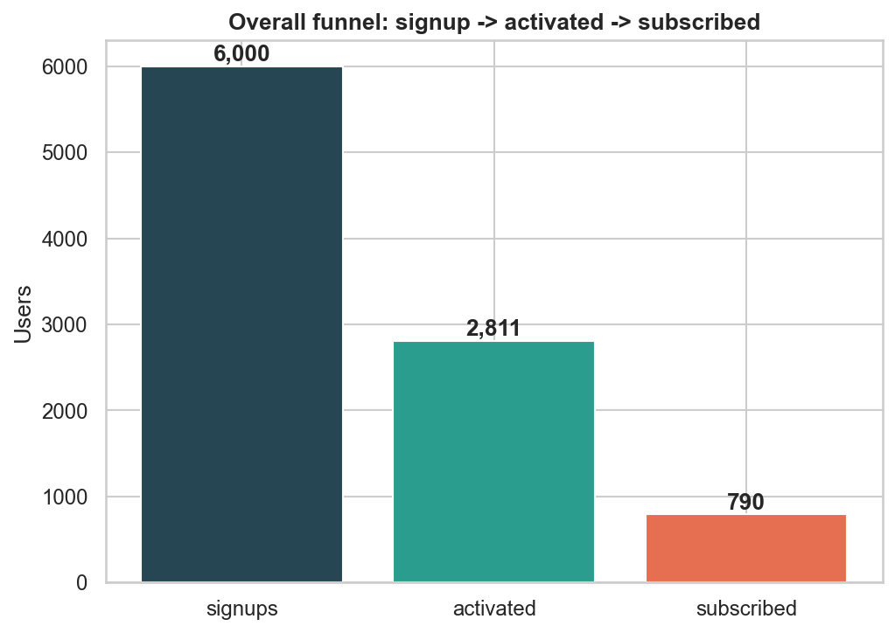
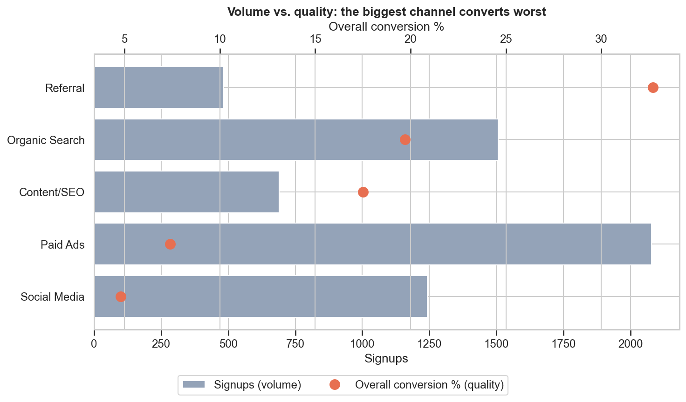
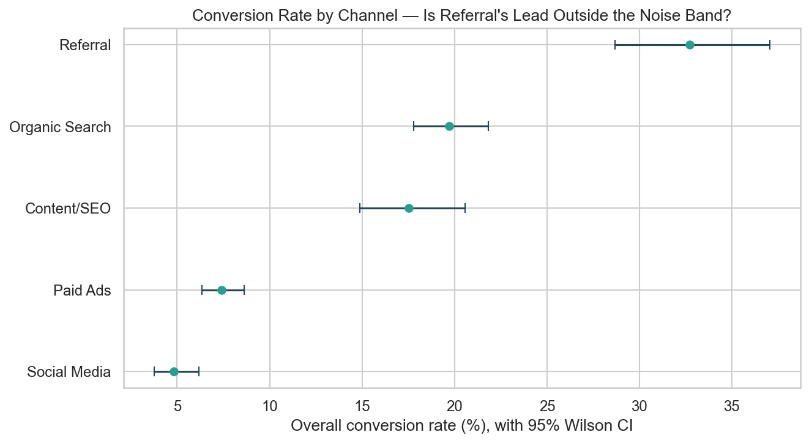
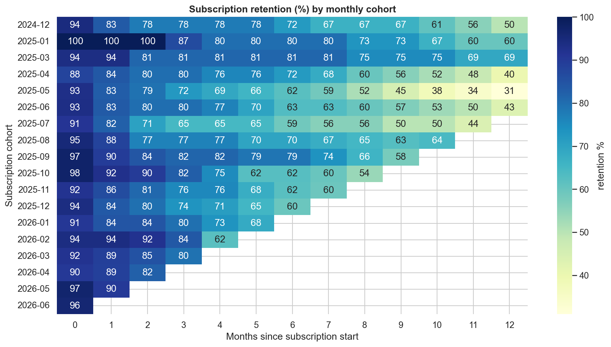
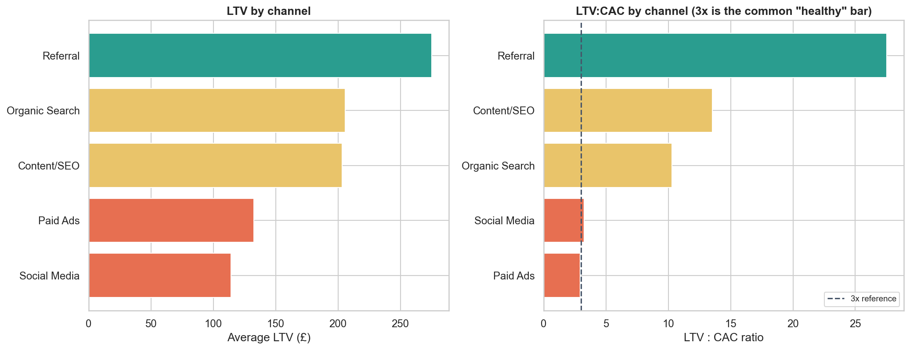

# SaaS Funnel, Cohort Retention & LTV:CAC Analysis

[](https://www.python.org/)
[](https://www.sqlite.org/)
[](https://pandas.pydata.org/)
[](tests/)

A synthetic but structurally realistic SaaS product dataset — signups, a
3-step conversion funnel (signup → activated → subscribed), and ongoing
subscriptions with churn — analysed with the three questions a growth/data
analyst actually gets asked: **where does the funnel leak, do subscribers
stick around, and which acquisition channel is actually worth the spend?**

**Dataset:** 6,000 signups, 5 acquisition channels, July 2024 - June 2026.
Channel quality is deliberately inverted from channel volume — Paid Ads
brings the most signups but converts and retains worst; Referral brings the
fewest but converts and retains best — so the LTV:CAC analysis surfaces a
genuine budget-reallocation recommendation, not a trivial "the biggest
channel is best" result.

**Stack:** Python 3.11 · SQLite · pandas · matplotlib/seaborn (plain SQL,
no BI tool — the analysis is the point)

---

## Why this project

1. **Funnel analysis is the most common growth/product-analytics
   ask** — this project demonstrates it as multi-step SQL (CTEs, `NULLIF`
   for safe division), not a black-box tool's output.
2. **Cohort retention here is subscription *survival***, correctly
   censored: a cohort's not-yet-elapsed months are excluded from the
   denominator rather than counted as retained, avoiding the classic bug
   where young cohorts look artificially healthier just because they
   haven't had time to churn yet.
3. **LTV:CAC is where the whole analysis lands on one decision**: not
   "which channel signs up the most users" but "which channel is actually
   worth another marketing pound" — with the CAC assumption stated
   explicitly rather than hidden.
4. **The recommendation is stress-tested, not just reported.** Referral has
   the smallest sample of any channel — `src/confidence.py` checks whether
   its lead survives that with a Wilson CI and a two-proportion z-test
   before the README calls it a real effect.

---

## Project Structure

```
ecommerce-cohort-funnel-analysis/
├── sql/
│   ├── 00_schema.sql                   # users / events / subscriptions
│   ├── 01_funnel_conversion.sql        # signup->activated->subscribed, overall + by channel
│   ├── 02_cohort_retention.sql         # subscription-survival cohort triangle (recursive CTE)
│   └── 03_ltv_and_recommendation.sql   # LTV and LTV:CAC by channel
├── src/
│   ├── generator.py    # synthetic SaaS funnel/subscription generator
│   ├── build_db.py     # loads the generated data into SQLite
│   ├── run_queries.py  # parses + executes the .sql files, labelled by query
│   └── confidence.py   # Wilson CI + two-proportion z-test for channel conversion rates
├── notebooks/
│   └── 01_funnel_cohort_ltv.ipynb  # runs every query, real results + charts + recommendation
├── tests/
│   ├── test_generator.py  # referential integrity, funnel monotonicity, quality inversion
│   ├── test_queries.py    # funnel/retention/LTV correctness invariants
│   └── test_confidence.py # Wilson CI / z-test correctness
└── pyproject.toml
```

---

## Results

### 1. The funnel leaks less than you'd think — until you split by channel

Overall: 6,000 signups → 2,811 activated (**46.9%**) → 790 subscribed
(**28.1%** of activated, **13.2%** end-to-end).



| Channel | Signups | Overall conversion |
|---|---|---|
| Paid Ads | **2,078** | 7.4% |
| Organic Search | 1,506 | 19.7% |
| Social Media | 1,243 | 4.8% |
| Content/SEO | 690 | 17.5% |
| **Referral** | **483** | **32.7%** |

**Paid Ads brings 4.3x more signups than Referral but converts at less than
a quarter of the rate** — a gap invisible in a dashboard that only reports
signup volume.



**Is Referral's lead real, or a small-sample fluke?** Referral has by far
the fewest signups of any channel (483, vs Paid Ads' 2,078) — exactly the
case where a headline rate should be checked before it drives a budget
decision. `src/confidence.py` adds a Wilson score CI per channel and a
two-proportion z-test of Referral against each other channel:



| Comparison | Gap | 95% CI | p-value | Significant |
|---|---|---|---|---|
| Referral vs Paid Ads | +25.3pp | [21.0pp, 29.6pp] | <0.001 | Yes |
| Referral vs Social Media | +27.9pp | [23.5pp, 32.2pp] | <0.001 | Yes |
| Referral vs Content/SEO | +15.2pp | [10.1pp, 20.2pp] | <0.001 | Yes |
| Referral vs Organic Search | +13.0pp | [8.3pp, 17.6pp] | <0.001 | Yes |

Every comparison is significant — Referral's smaller sample gives it the
widest confidence interval of any channel (28.7%-37.0%), but even its lower
bound comfortably clears every other channel's own upper bound. The budget
recommendation below isn't resting on a small-sample fluke.

### 2. Subscription retention decays the way real SaaS products' does



Retention starts near 90-100% (month 0, by construction — a subscription
that just started hasn't had time to churn) and decays steadily, with the
usual cohort-to-cohort variation. Cohorts are restricted to 15+ subscribers
so percentages aren't noise from a handful of people.

### 3. LTV:CAC turns funnel + retention into a budget decision

| Channel | Avg. LTV | Est. CAC | LTV:CAC |
|---|---|---|---|
| **Referral** | **£275** | £10 | **27.5x** |
| Content/SEO | £203 | £15 | 13.5x |
| Organic Search | £206 | £20 | 10.3x |
| Social Media | £114 | £35 | 3.3x |
| Paid Ads | £133 | £45 | **2.95x** |



**Recommendation:** shift incremental acquisition budget from Paid Ads
toward scaling the Referral program. Paid Ads sits barely above the common
3x "healthy SaaS" bar once its high CAC and faster churn are both priced
in; Referral is 9x more efficient by the same measure. This isn't "cut Paid
Ads to zero" — it's still the primary volume channel — but the next
marginal pound is far better spent buying Referral-quality growth.

> **Caveat, stated honestly:** CAC figures are illustrative assumptions
> (documented in `sql/03_ltv_and_recommendation.sql`, matched exactly to
> the generator), not pulled from a real ads platform. The *methodology*
> (funnel by channel → retention by channel → LTV:CAC) is the reusable
> part; the specific ratios would need real spend data to action directly.

---

## Quickstart

```bash
# 1. install
pip install -e ".[dev]"

# 2. build the database (regenerates the synthetic dataset)
python -m src.build_db

# 3. run the queries from the command line
python -m src.run_queries

# 4. or open the notebook for results + charts + the recommendation
jupyter notebook notebooks/01_funnel_cohort_ltv.ipynb

# 5. run the tests
pytest tests/ -v
```

---

## Technical Notes

- **Synthetic but honest:** channel quality (activation rate, subscribe
  rate, churn hazard, plan price) is deliberately inverted from channel
  volume in `src/generator.py` — every number the analysis surfaces traces
  back to a documented parameter there.
- **Correct censoring in cohort retention:** `sql/02_cohort_retention.sql`
  only counts a (cohort, month-offset) pair once that many months have
  actually elapsed since the subscription started — a recent cohort's
  future months are excluded, not counted as retained.
- **CAC is a documented assumption, not fabricated fact:** it isn't in the
  transactional data (it lives in an ads platform/finance system in a real
  business) — the query's CTE states the exact values and why they differ
  by channel.
- **`NULLIF` guards against divide-by-zero** in the channel-conversion
  query, for the (non-occurring here, but real-world-possible) case of a
  channel with zero activations.
- **`src/confidence.py` uses the Wilson score interval, not the naive
  normal-approximation ("Wald") interval** most intro material teaches —
  Wilson stays well-behaved for small n or a rate near 0%/100%, both of
  which occur here (Referral's n=483, Social Media's ~5% rate). scipy
  supplies the normal CDF/quantile; the pooling and test statistic for the
  two-proportion z-test are implemented directly.
